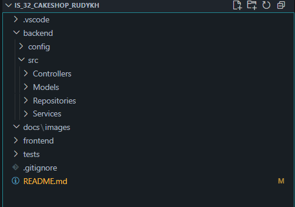

Інтернет-магазин кондитерської "Ruby" (ІС-32)

Опис проекту:
Проект є веб-системою "Інтернет-магазин кондитерської", яка дозволяє клієнтам здійснювати онлайн-замовлення продукції, а адміністраторам - управляти товарами та замовленнями.

Поточний стан:
Frontend: Реалізовано інтерактивний HTML/CSS/JS прототип.
Backend: Створено базову структуру коду для PHP-додатку.

Структура проекту:
Проект має наступну структуру папок, яка відокремлює frontend-прототип від backend-логіки:

Ролі та розподіл завдань:
Ролі розподілені відповідно до основних бізнес-процесів та архітектури SOLID:

Лємаєва О.М. - Full-stack розробник
Функціонал User та Authentication. Створення базової структури для AuthController (прийом запитів), AuthService (бізнес-логіка реєстрації/входу), UserRepository (робота з базою даних) та пов'язаних моделей (User, AdminUser, Address).

Рудих К.О. - Full-stack розробник
Функціонал Product та Order. Це включає створення базової структури для ProductController, OrderController (прийом запитів), OrderService, PaymentService (бізнес-логіка каталогу, кошика, оформлення замовлення), ProductRepository.

Філіпович Д.О. - Тестувальник (QA)
Відповідає за створення та налаштування тестового оточення (папка tests/). У майбутньому відповідатиме за написання unit-тестів для перевірки коректності роботи всієї створеної бізнес-логіки та моделей даних. А також створено функціонал OrderRepository (робота з БД) та всіх пов'язаних моделей (Product, Category, Image, Cart, CartItem, Order, OrderItem, Payment, Shipment)

Інструкції для запуску:
Цей проект є монолітним PHP-додатком. Frontend і backend працюють разом і запускаються через локальний веб-сервер.

1. Встановлюємо локальний сервер (XAMPP), який включає Apache (веб-сервер) та MySQL (сервер баз даних)
2. Запускаємо модулі Apache та MySQL на панелі керування XAMPP
3. Щоб відкрити сайт, переходимо у браузері за адресою: http://localhost/is_32_cakeshop_rudykh/frontend/
